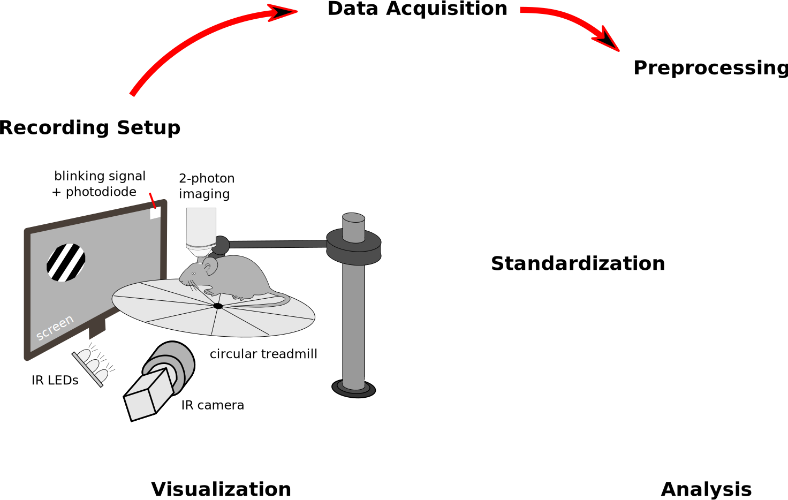

<!--<div></div>-->

<div></div>

# Vision Physiology Software

> *An integrated software for cellular and network physiology of visual circuits in behaving mice*

--------------------

The software is organized into several modules to perform the acquisition, the preprocessing, the standardization, the visualization, the analysis and the sharing of multimodal neurophysiological recordings.

The different modules are detailed in the [documentation below](README.md#modules-and-documentation) and their integration is summarized on the drawing below:
<p align="center">
  
</p>


--------------------

## Install

Simply:
```
pip install physion
```

N.B. the `PyQt` package can be broken after those steps, re-start from a fresh install with `pip uninstall PyQt5` and `pip install PyQt5`.

-> For an installation on an acquisition setup
```
conda env create -n acquisition -f acquisition_environment.yml
```

## Modules and documentation

The different modules of the software are documented in the following links:

- [Visual stimulation](src/physion/visual_stim/README.md)
- [Multimodal Acquisition](src/physion/acquisition/README.md)
- [Intrinsic Imaging](src/physion/intrinsic/README.md)
- [Electrophysiology](src/physion/electrophy/README.md)
- [Calcium imaging](src/physion/imaging/README.md)
- [Pupil tracking](src/physion/pupil/README.md)
- [Face Motion tracking](src/physion/facemotion/README.md)
- [Behavior](src/physion/behavior/README.md) 
- [Assembling pipeline](src/physion/assembling/README.md)
- [Hardware control](src/physion/hardware_control/README.md)
- [Visualization](src/physion/dataviz/README.md)
- [Analysis](src/physion/analysis/README.md)
- [Sharing](src/physion/sharing/README.md)

## Troubleshooting / Issues

Use the dedicated [Issues](https://github.com/yzerlaut/physion/issues) interface of Github.
