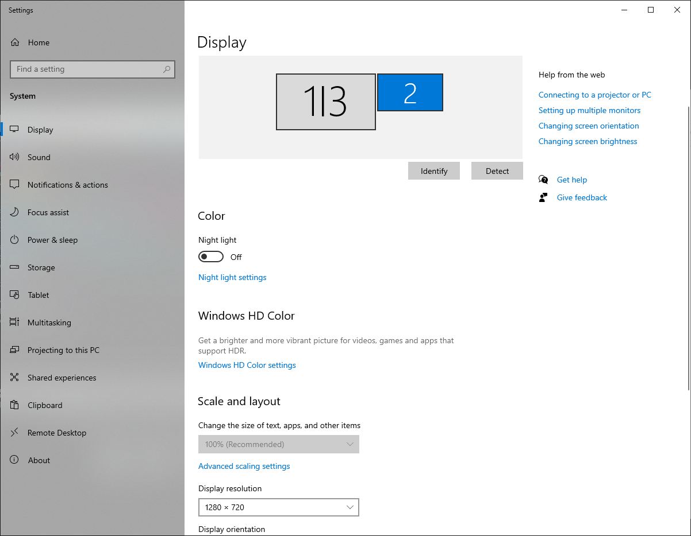

# Installation Steps

> *installation instructions on an experimental setup

> *so far tested in Windows 10 and Windows 11, Need to use `Python 3.10`*

Executables and drivers are stored in the following [drive folder](https://drive.google.com/drive/folders/1z_9GERKwQc6SKhsBnSZh-2scl_wdgHQs?usp=drive_link)

## A) Set up the `python` environment

### A.1) Install the `miniforge` distribution

Run the executable: `Miniforge3-Windows-x86_64.exe` (available at this [link](https://github.com/conda-forge/miniforge/releases/latest/download/Miniforge3-Windows-x86_64.exe))

With the following settings:
- Install it in the location: `~/miniforge3`
- Add python to your path

### A.2) Create the `acquisition` environment

```
cd work/physion/docs/install
conda env create -n acquisition -f acquisition.yml
```

For the packages (**After** the NIdaq, ... below settings), install them in the following order:
```
pip install nidaqmx
pip install Downloads\spinnaker_python-4.2.0.83-cp310-cp310-win_amd64.whl # assumes you extracted in ~/Downloads
pip install git+https://github.com/yzerlaut/simple_pyspin
pip install opencv-python numpy scipy scikit-image PyQt5 pyqtgraph==0.13.3 natsort pyqtdarktheme ffmpeg==1.4 pynwb==2.5.0 hdmf==3.11.0 numba matplotlib
```

### A.3) Install other useful packages

```
conda install git vim
```

## B) NI DAQ setup

### B.1) Re-install Visual C++ Redistributable on Windows

That's usually a necessary step. Download `vc_redist.x64.exe` from the [Microsoft Website](https://learn.microsoft.com/fr-fr/cpp/windows/latest-supported-vc-redist?view=msvc-170) and install it.

Permanent link to [vc_redist.x64.exe](https://aka.ms/vs/17/release/vc_redist.x64.exe).

### B.2) Install the NIDAQ MX drivers

Download and install the NIDAQ MX dirvers from the [National Instruments website](https://www.ni.com/fr/support/downloads/drivers/download.ni-daq-mx.html)

## C) Screen Setup 

### C.1) Display Settings on Windows

Set the visual stimulation screen as the second monitor

<p align="center">
  
</p>

### C.2) Other settings

- Put a black background on the Desktop (because this is what the mouse will see when not running any experiment)

- Hide the taskbar on the non-primary display


## D) FLIR Camera setup

Set up the camera to record mouse behavior (pupil dilation and whisking activity).

### D.1) Install the Spinnaker SDK

Download the installer on the [FLIR website](https://www.flir.com/support-center/iis/machine-vision/downloads/spinnaker-sdk-download/spinnaker-sdk--download-files/)

Current version is: `SpinnakerSDK_FULL_3.1.0.79_x64.exe`

### D.2) Install the python Spinnaker API

Download the zip folder that contain the "wheel" on the [FLIR website](https://www.flir.com/support-center/iis/machine-vision/downloads/spinnaker-sdk-download/spinnaker-sdk--download-files/)

Current version is: `spinnaker_python-3.1.0.79-cp310-cp310-win_amd64`

Install on the `acquisition` environment with:
```
conda activate acquisition
pip install spinnaker_python-3.1.0.79-cp310-cp310-win_amd64.whl
```

### D.3) Install the FlyCapture software

Current version is: `FlyCapture_2.13.3.61_x64.exe`

### D.4) Configure the Image properties in the FlyCapture software

!! SCREENSHOT THE SETTINGS HERE !!

### D.5) Run the test

Run the `test.py` script to make sure the camera runs fine:
```
cd %UserProfile%\work\physion\src\physion\hardware\FLIRcamera & python test.py
```

## E) Thorlabs Imaging Camera setup

### E.1) Install `ThorCam` 

Download the [installer from the Thorlabs website](https://www.thorlabs.com/software_pages/ViewSoftwarePage.cfm?Code=ThorCam) and install `ThorCam`.

Choose the 64-bit version. Current Version is `3.7.0.6`

### E.2) Install the Python SDK

After the Thorcam installation, got to `C:\Program Files\Thorlabs\Scientific Imaging\Scientific Camera Support`

There is a zipfile called `Scientific_Camera_Interfaces.zip`. Unzip it in the `Downloads` folder.

This is where the python SDK is. Install it with
 
```
cd %USERPROFILE%\Downloads\Scientific_Camera_Interfaces\Scientific Camera Interfaces\SDK\Python Toolkit
conda activate acquisition
pip install thorlabs_tsi_camera_python_sdk_package.zip
```

E.3) Add the camera dlls to physion

Now copy all the 64-bits dlls located in: 
```
%USERPROFILE%\Downloads\Scientific_Camera_Interfaces\Scientific Camera Interfaces\SDK\Python Toolkit\dlls\64_lib
```
into the folder: 
```
src/physion/hardware/Thorlabs/camera_dlls.
```

## F) QImaging Rolera Camera setup

### F.1) Install MicroManager

Download and execute the [installer from the MicroManager website](https://micro-manager.org/Download_Micro-Manager_Latest_Release)

Choose the 64-bit version. Current Version is `2.0.0`

### F.2) Configure the Camera

[...]

### F.3) Install `pycromanager`

```
pip install pycromanager
```

### F.4) Run test

Setup test:
```
python -m physion.harware.QCamera.camera_core_test
```

Frame rate test:
```
python -m physion.harware.QCamera.camera_core_test
```

N.B.  [!!] `MicroManager` needs to be running to access the camera via the API


## G) Create Windows Launchers

Create Windows shortcut to launch the Acquisition and Analysis programs.

On the desktop, right click -> `New` -> `Shortcut` and modigy its `Properties as follows: 

### G.1) Analysis Program

- Target:
  ```
  python -m physion 
  ```
- Start in:
  ```
  %UserProfile%\work\physion\src
  ```

### G.2) Acquisition Program

- Target:
  ```
  %SystemRoot%\System32\cmd.exe /D /S /K %UserProfile%\miniforge3\Scripts\activate.bat %UserProfile%\miniforge3\envs\acquisition & python -m physion acquisition
  ```
- Start in:
  ```
  %UserProfile%\work\physion\src
  ```
