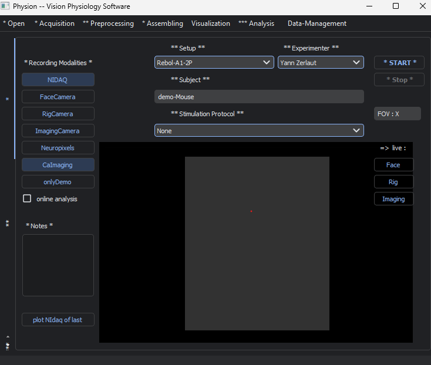

# Interface for experimental protocols

## _Prerequisite_

The acquisition setup shold have a folder structure like this:

```
~/
   # in the home folder (i.e. the parent folder of the Documents, Downloads, ... folder)
   Documents/...
   Downloads/...

   DATA/
      Joana/
      Yann/
      ...
   visualStim-protocols/
      Joana/
         full-field-gratings-3contrasts/
         ...
      Yann/
         quick-spatial-mapping/
         inverse-receptive-fields/
         ....

```

## GUI
The interface is minimal:

<p align="center">
  
</p>

## 1. Pick the configuration that you want to use.

   The set of configuration is loaded from the files in the [configs/](configs/) folder.

   Each file should be a JSON file, it specifies some key metadata related to the experiment:
   ```
   {
      "-----------------------------------------":"",
      "NIdaq":{
         "acquisition-frequency":5000,
         "analog-outputs":{
               "N-channels":1,
               "channel-labels":[
                  "photodiode-signal-from-screen"
               ]
         },
         "analog-inputs":{
               "N-channels":1,
               "channel-labels":[
                  "photodiode-signal-from-screen"
               ]
         },
         "digital-outputs":{
               "lines":"port0/line0-3",
               "line-labels":[
                  "trigger-for-2P-start",
                  "visual-stim-episode-start",
                  ""
               ]
         },
         "digital-inputs":{
               "lines":"port0/line4-7",
               "line-labels":[
                  "photodiode-signal-from-screen",
                  "",
                  ""
               ]
         }
      },
      "-----------------------------------------":"",
      "FaceCamera-frame-rate":30,
      "FaceCamera-1cm-in-pix":480,
      "-----------------------------------------":"",
      "Screen":"Dell-2020",
      "Height-of-Microscope-Camera-Image-in-mm":2.7,
      "-----------------------------------------":"",
      "rotating-disk":{
         "radius-position-on-disk-cm":5.5,
         "roto-encoder-value-per-rotation": -12563.0
      },
      "-----------------------------------------":"",
      "root_datafolder":"DATA",
      "lab":"Rebola and Bacci labs",
      "institution":"Institut du Cerveau et de la Moelle, Paris"
   }
   ```

## 2. Pick the modalities that you want to have by checking the upper boxes.

   N.B. the Camera initialization might take 5-6 seconds after clicking


## 3. Choose a visual stimulation protocol

Either `None` or one of the protocols stored in the [protocols/](protocols/) folder (and, if `"protocols"` is not set to "all", specified in the configuration file).


## 4. Run

Click "Run" to launch the recording.


## Under the hood

Using separate `threads` for the different processes using the `multiprocessing` module, we interact with those threads by sending "record"/"stop" signals. The different threads are:

- The NIdaq recording

- THe visual stimulation

- The FLIR-camera
