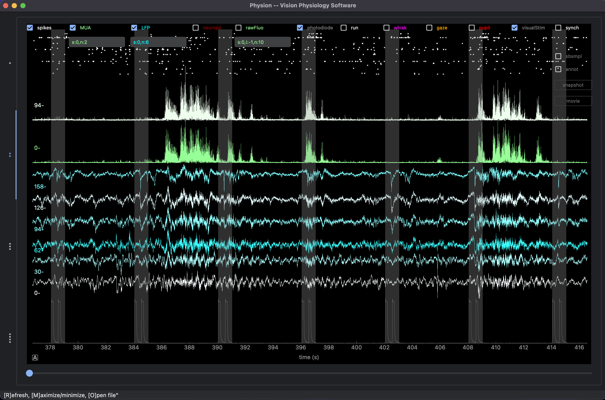

# Data Visualization

The software allows you to visualize data though various forms.

## 1) Interactive viewer for NWB files

This interactive data visualization module relies on the excellent [PyQtGraph module](http://pyqtgraph.org/).

### Usage

Start physion in the "analysis" mode. In the top menu, go to "Open / NWB File". Or "Open / Folder" this will pre-load all NWB files of that folder and they can be accessed through the calendar afterwards.

- refresh the viewer with "R" (whenever you zoom, change params)
- open file with "O"
- maximize/minimize the window with "M"

Next check and uncheck the modalities that you want to display:

- **sbsmpl**: **_strongly_** subsamples the data for fast display [N.B.] turned on by default !!
- **annot**: display the visual stimulation parameters on top of the plot
- **synch**: shows the synchronizing signal (neuropixels only)
- some features have additional text parameters (rawFluo, LFP, MUA)
    - **number of traces**: `n:4` means showing n=4 traces
    - **smoothing**: `s:10` means smoothing with a window of 10 points
    - **index start**: `i:0` means starting at index 0 (`i:-1` means randomly picking ROIs)

[N.B.] Need to refresh with "R" everytime you want the viewer to update.

### Examples

#### Calcium Imaging recording with behavior

showing (from top to bottom):
- raw traces of ROI fluorescence (you can add the neuropil display)
- pupil diameter
- gaze variations
- whisking (face motion energy)

#### Neuropixels recording with visual stimulation

showing from top to bottom:
- spikes
- Multi-Unit Activity
- LFP
- photodiode
- visual stimulation episodes overlay

## 2) Producing figures showing raw data

Demo in the notebook [Visualize-Raw-Data.py](../../../notebooks/Visualize-Raw-Data.py)

## 3) Movie generation

Demo in the notebook [Build-Movie.py](../../../notebooks/Build-Movie.py)

