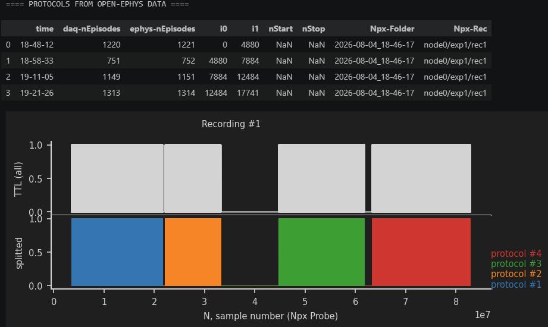

# Electrophysiology

## Overall pipeline 

__*following an experimental session recorded with OpenEphys & physion*:__

### 0. *Preprocess the facecamera data (see [pupil](../pupil/README.md) and [facemotion](../facemotion/README.md) documentation)*

- compute and save the pupil trace
- compute and save the facemotion trace
- export to mp4 movie (in the "physion-analysis" software "Data-Management/Convert Camera to Movie")
- delete the raw `FaceCamera-imgs` folder

### 1. Build the DataTable for the different protocols of the session

Open the terminal (miniforge) on the `base` environment. 
For an experiment recorded in `~/DATA/2026_08_04`, you build the datatable with the command:
```
cd %USERPROFILE%/physion/src
python -m physion.assembling.dataset build-DataTable %USERPROFILE%/DATA/2026_08_04
```
this will create a file: `~\DATA\2026_08_04\DataTable0.xlsx`.

Fill the column `Npx-Folder` (for example 2026-08-04_16-13-00) 

<!-- and recordings information (`Npx-Rec`for example node0/exp1/rec1).     -->

### 2. Run the [Ephys-Assembling.py](../../../notebooks/Ephys-Assembling.py) notebook.    

Important parameters to set up:
- `ELECTRODE_RANGE` defines the sub-selection of electrodes **kept for analysis** (default `ELECTRODE_RANGE=[0,200]`)
- `PROBE_NAME` = 'ProbeA'
- `EXP`  ID of the recording (starting from 1, default `EXP=1`)
- `NODE` ID of the desired Recorde Node (default `NODE=0`)
- `STREAM_NAME` default `STREAM_NAME='Record Node 101#OneBox-100.ProbeA'`

This will:
- find the probe samples aligned to NIdaq acquisition  

1. **CHECK** that `daq-nEpisodes` & `ephys-nEpisodes` match (+/-1) 

    

2. **CHECK** that synchronizing steps match in the 

    

- focus on the range of electrodes defined (those in the brain)
- detect and remove bad channels
- set the electrode subsamplig per protocol [TODO]  
    default  
        - 2: for flashed stimuli (to protocol to identify layer 4)  
        - 8: for the rest  
- [???] compress and save as binary the data

### 3. Copy the Data from Acquisition to Analysis computer 

```
...
```


### 2. run the spike sorting using spike interface (kilosort for now)

### 3. assemble the data into a NWB file using the command:  

`python -m physion.assembling.nwb ~/DATA/2026_01_01/DataTable.xlsx`


See: [../assembling/add_ephys.py](../assembling/add_ephys.py) script

```
import spikeinterface.full as si
```

1. remove bad channels (with `si.detect_bad_channels(rec, method="coherence+psd")`)
2. build the electrode table
3. add the spike times of units selected by `kilosort`/`phy`
4. add the spike templates of units selected by `kilosort`/`phy`
5. runs peak detection (locally exclusive, see `from spikeinterface.sortingcomponents import peak_detection`)
6. write the events per channel (of the above peak detection)
7. computes and write LFP

## Extracting Single Units Spiking

- spike sorting with kilosort

- 

## Computing the Local Field Potential (LFP)

- we band-pass filter in the band `[0.5, 300]`Hz

- 

N.B. Here we take care of not creating artefacts on boudaries of data chunks (so we increase the chunk_size to a really high value)

## Computing Multi-Unit Activity (MUA)

using the function `compute_freq_envelope` of `physion.ephys.tools` with a band in `[300,3000]`Hz.

This is using a continuous wavelet transform to extract the time-varying high-frequency activity in the recording.

To visualize the effect of the continuous wavelet transform acting in different frequency bands:


```
from physion.ephys.tools import compute_freq_envelope

t = np.linspace(0, 11, int(5e4))
signal = np.zeros(len(t))

np.random.seed(11)
N = 20
for freq, start, amp in zip(
    list(np.random.uniform(0.5, 20, N)), list(1+np.arange(N)/N*9), list(np.random.randn(N)),
    ):
    sigma = 1./freq/2.
    signal += np.sin(2*np.pi*freq*(t-start))*\
        np.exp(-(t-start)**2/2./sigma**2)*\ amp

fig, ax = pt.figure(axes=(1,4), ax_scale=(2,1.5))
ax[0].plot(t, signal)
pt.set_plot(ax[0], xlabel='time (s)', ylabel='signal (a.u.)')
for i, band in enumerate([[5,20], [1,10], [0.2,1]]):
    mua = compute_freq_envelope(signal, 1./(t[1]-t[0]),
                    np.linspace(band[0], band[1], 5))
    ax[i+1].fill_between(t, 0*t, mua)
    pt.set_plot(ax[i+1], xlabel='time (s)', ylabel='envelope (a.u.)',
                    title='freq. band: [%.1f,%.1f]Hz' % tuple(band) +\
                        40*'  ')
fig.savefig('physion/docs/ephys/wavelet-envelope.png')
```

