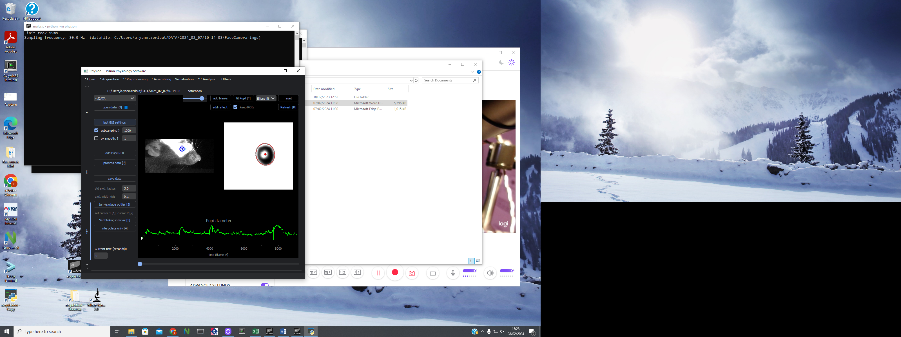

# Pupil Tracking

## Recording

[...]

## Analysis

  

1. You should open the data in Analysis – preprocessing – Pupil – open data [O]
2. Select last GUI settings – will came the settings that the last person used, so you can modify the blue cicle in the pupil to ajust. 
3. Reset (to reset the things that you modify), add blank (to add whith points if have dark things that don’t are the pupil in the image), add reflect (to add the black point, like insede of the pupil that reflect light), fit pupil or just letter F (to ajust the red cicle in the pupil).
4. You should correct all the alterations in the fit pupil, because it be change with the time in the video, so check all the video. 
5. With subsampling check, click in process data to show how will be. 
6. After if you don’t have any alteration in the parameters, you discheck the Subsampling and click in process data
7. After process (can take a time), click in Save data. 
