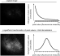

# Compression 

## Compressing 2P data

Principle: 

- we achieve high compression thanks to the shift to 8bit encoding (in mp4 format)
- to not loose to much data in the low fluorescence range (where most ROIs activity lies), we apply a logarithmic transform so that the 8-bit discretization better encodes the diversity of low fluorescence values.
- So need to apply the exponential tranformation to go back to the original fluorescence range.

Illustrated below:

