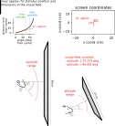
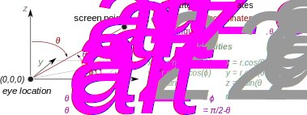
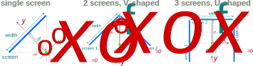
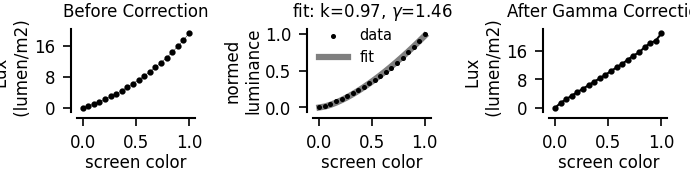

# Visual stimulation

## Overview 

This module handles the presentation of visual stimuli on a given screen. Vision neuroscience expresses [visual stimuli in angular dimensions](#mouse-visual-field-and-screen-position) and mouse vision is investigated under specific luminosity conditions. Those two aspects require some [calibration steps (see below)](#screen-calibration) for each screen setup.

To use the visual stimulation feature, be sure to follow the installation steps and screen settings described in the [installation instructions for an acquisition setup](../../../docs/install/acquisition.md)

_**Implementation**_. The custom `visual_stim` object at the basis of the visual stimulation implementation lies is defined in [main.py](./main.py). Its children objects with stimulus-specific features are found in the [stimuli/](./stimuli) folder.

_**Under the hood**_.  The stimulus presentation relies on `PyQt5` (`QMultimedia` module) for the display on the screen, see [show.py](./show.py)

## Usage

### 1. Prepare a Visual Stimulation Protocol

A given protocol is described by a `json` file.   
It can be a single stimulus type or a "multiprotocol" (see below).

#### 1.a) Single Stimulus Protocol (with parameters variations)

The syntax for a single stimulus with parameter variations is the following:

```
{
    "Presentation": "Stimuli-Sequence",
    "Stimulus": "grating",
    "Screen": "Dell-4220",
    "-------------------------------------------- 1": 0,
    "presentation-duration": 1,
    "presentation-prestim-period": 4,
    "presentation-poststim-period": 4,
    "presentation-interstim-period": 2,
    "presentation-blank-screen-color": 0.5,
    "N-repeat": 10,
    "-------------------------------------------- 2": 0,
    "x-center-1": -40.0, "x-center-2": 40.0, "N-x-center": 5,
    "y-center-1": -20.0, "y-center-2": 20.0, "N-y-center": 4,
    "angle-1": 0.0, "angle-2": 135.0, "N-angle":4,
    "-------------------------------------------- 3": 0,
    "spatial-freq": 0.06,
    "speed": 0, "radius": 10,
    "json_location": "/Users/yann/Desktop/Visual-Stim-Bacci-Npx"
}
```

[ [!!] ]() N.B. make sure that your screen is correctly described in the [screens.py](./screens.py) script.

#### 1.b) Protocols made of Multiple Stimulus Types

Multiprotocols can be build as a list of single protocols with the following syntax:

```
{
  "Presentation": "multiprotocol"
  "shuffling" :"full",
  "shuffling-seed" :23,
  "Protocol-1": "subprotocols/NDNF/moving-dots.json",
  "Protocol-2": "subprotocols/NDNF/random-dots.json",
  "Protocol-3": "subprotocols/NDNF/static-patch.json",
  "presentation-blank-screen-color": 0.5,
  "presentation-prestim-period": 3,
  "presentation-poststim-period": 3,
  "presentation-interstim-period": 3,
  "Screen": "Dell-2020",
  "movie_refresh_freq":30,
}
```

## 2. Build the Protocol Video

A protocol need to be converted to a set binary movies befire being displayed.
This is achieved via the following command:

```
python -m physion.visual_stim.build ~/Desktop/protocol-folder/drifting-gratings.json
```
The generated movie will be either `movie.mp4` or `movie.wmv` depending on the platform (unix vs MsWin).

To be used in the acquisition UI the protocol folder needs to be moved (the full folder, i.e. video+metadata) at the location `physion/acquisition/protocols/movies`.


[ [!!] ]() don't forget to move the video after building it !


## Mouse visual field and screen position

The setup corresponds to the following setting:

<p align="center">
  
</p>

The calculation using the spherical coordinates of angular view:
<p align="center">
  
</p>

The transformation into screen positions is available on the [VisualStim-design notebook](../../../notebooks/Visual-Stim-Design.py-Stim-Design.py).

Note that the conventions for the different screen setups are the following:
<p align="center">
  
</p>

## Screen calibration

### 1. Luminosity setting (brightness & contrast)

The overall idea is to maximize the contrast on the screen while adjusting the brightness to get to the desired luminosity value.

The desired value of illumination on the mouse eye position is:

- 20-25 lux (i.e. lumens/m2) for the white screen

To reach this, use a light-meter and monitor illumination while presenting a white screen on the stimulation display.

To build a simple protocol that shows a full-screen at the three screen colors black=0, grey=0.5 and white=1, you can use the protocol:
```
{
    "Presentation": "Stimuli-Sequence",
    "Stimulus": "uniform-bg",
    "Screen": "Dell-2020",
    "----------------------------------------1": 0,
    "presentation-duration": 5,
    "presentation-prestim-period": 1,
    "presentation-poststim-period": 1,
    "presentation-interstim-period": 1,
    "N-repeat": 1,
    "----------------------------------------2": 0,
    "screen-color-1": 0.0,
    "screen-color-2": 1.0,
    "N-screen-color": 3,
}
```

### 2. Gamma correction

We present a uniform full-screen at different levels of luminance, we use a photometer to measure the true light intensity in the center of the screen.

We fit the formula `f(x) = y = k * x^g ` (constrained minimization, see [gamma-correction.py](./gamma-correction.py) and fits below).
We inverse the above formula (`fi(y) = x = (y/k)^(1/g)`), and we scale the luminosity in `Psychopy` accordingly (inserting the measured `k' and 'g' parameters, here we took: `k=1.03` and `gamma=1.77`).

The gamma correction parameters have to be inserted in the [./screens.py](screens.py) script.

We show below the measurements before and after the correction

<p align="center">
  
</p>

## Making Stimulus Schematic for Figures

A [svg file: visual-stimuli.svg](../../../docs/visual_stim/visual-stimuli.svg) provides a basis to draw stimuli schematics in Inkscape.

## Tracking stimulus presentation with a photodiode

The onset timing of the stimulus presentation is very hard to precisely control from the computer. So, to have the ability to realign stimulus presentation to the physiological recordings (see the [Assembling module](../assembling/README.md), we monitor the presentation of the stimuli on the screen with a photodiode.
We add a blinking square on the left-bottom corner of the screen).
Realign physiological recordings thanks to a photodiode signal


